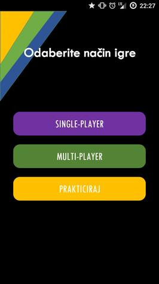
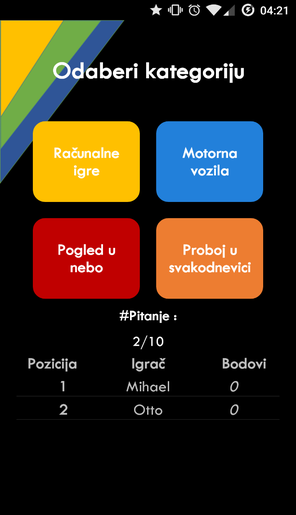
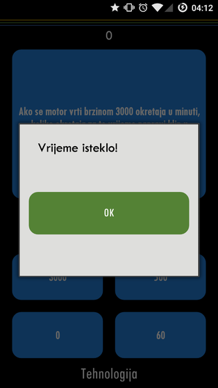
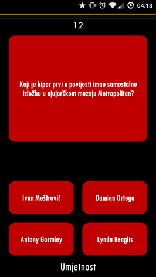
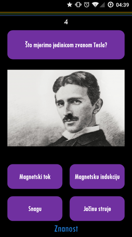
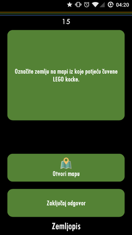

# Clash-of-brains

## O igri
* Single-Player
    * Igrač nastoji što više pitanja točno odgovoriti zaredom čime povisuje svoje bodove
    * 1 netočan odgovor završava igru
* Multi-Player
    * Igrači naizmjence odgovaraju na pitanje iz kategorije koju bira igrač s najmanje bodova na kraju svakog pitanja
* Prakticiraj
* * Igrač nastoji što više odabrati točnih(i brzih) odgovora od ukupno 10 pitanja

## Kategorije pitanja

| Kategorija         | Boja           |
| ------------- |:-------------:| 
| Znanost  | Ljubičasta  |
| Zabava  | Žuta  |
| Tehnologija  | Plava  |
| Zemljopis | Zelena  |
| Umjetnost  | Crvena  |
| Povijest  |  Narančasta |

## Pitanja
* Svako pitanje ima trajanje od 15s/30s nakon čega se odgovor prihvaća kao netočan
* Svako pitanje ima ponuđena 4 moguća odgovora od kojih je samo jedan točan, osim kod slučaja s Google Maps gdje je nakon odabira lokacije potrebno zaključati odgovor

## Vrste pitanja
* Pitanje bazirani na tekstu s pripadajućim ponuđenim odgovorima
* Pitanja bazirana na slici s pripadajućim ponuđenim odgovorima
* Pitanja bazirana na odabiru tražene lokacije pomoću Google Maps 

## High score
* Mogućnost pregleda poretka bodova s odgovarajućim imenima
* Odnosi se na Single-Player opciju igre jer se jedino tamo daje opcija za spremanje bodova

## Tehnologije
* Xamarin Android
* JSON Serializer/Deserializer
* Google Maps Services

